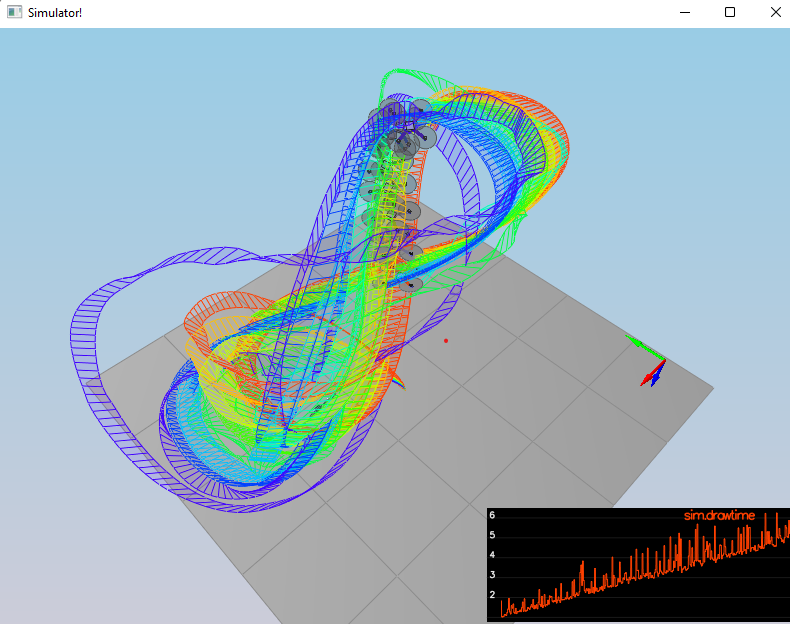
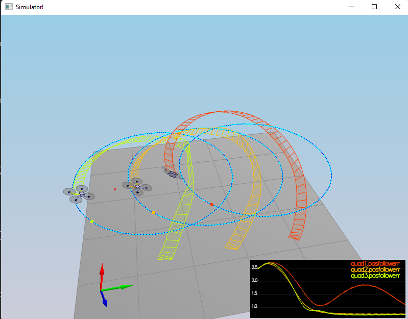
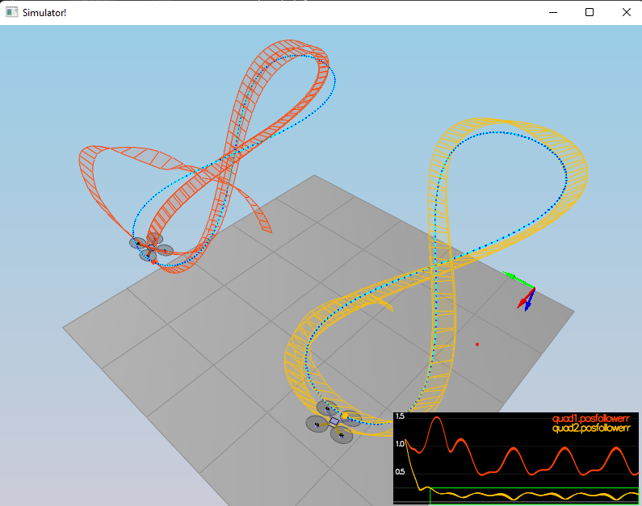

# Project Writeup Template

## Project Overview

This project involves the implementation of various control systems for a drone using C++. The control systems include body rate control, roll pitch control, altitude control, lateral position control, yaw control, and the calculation of motor commands. Each controller is designed to handle specific aspects of the drone's flight dynamics and to ensure stable and responsive control.

## Implemented Controller

### Body Rate Control

**Criteria:** Implemented body rate control in C++.

That one was easy:

- The body rate P-controller computes the difference between the desired body rates and the actual body rates.
- It then multiplies this difference by a proportional gain to compute the commanded moments.
- The moments of inertia of the drone are used to accurately compute the required moments.

### Roll Pitch Control

**Criteria:** Implement roll pitch control in C++.

And that one was hard to implemnt and debug. It turned out that sometimes collective thrust is zero (though rarely) so I had to take it into account. I made a lot of mistakes before getting to my final result.

The controller uses acceleration and thrust commands, in addition to the vehicle attitude, to output a body rate command.

### Altitude Control

**Criteria:** Implement altitude controller in C++.

This is a full PID controller.
This controller returns negative thrust due to NED coordinates. I use rotation matrix to represent thrust vector in world cordinates.

### Lateral Position Control

**Criteria:** Implement lateral position control in C++.

I had to remember to limit all the values to maxAccelXY , otherwise my drone was not constrined. I'm quite proud of using .norm() and then multiplying by the constant to calc the maximum value.

### Yaw Control

**Criteria:** Implement yaw control in C++.

This one gave a headhake because I still don't understand why the output value should be negative - it just came out of the debug and the behaviour of the drone. I think what is happening is that the drone simulator has mixed up numbering of thrusts/numbering of drone propellers.

### Calculating Motor Commands

**Criteria:** Implement calculating the motor commands given commanded thrust and moments in C++.

This one is also a bit strange to me - when I tested numbering of propellers is different than on the course. Also what is strange to me is then I set two right propellers to have positive value of thrust and set both left propellers to zero the drone tilts to the right (but should tilt to the left due to the moment).

All values are calculated with an inverted matrix - thus we need to divide every value by 4.

## Conclusion

I was able to make all scenarios work properly, even the scenario no 4. with CircleNoFF.txt trajectory. Overall the tuning (without the impl) took me about 10h.

